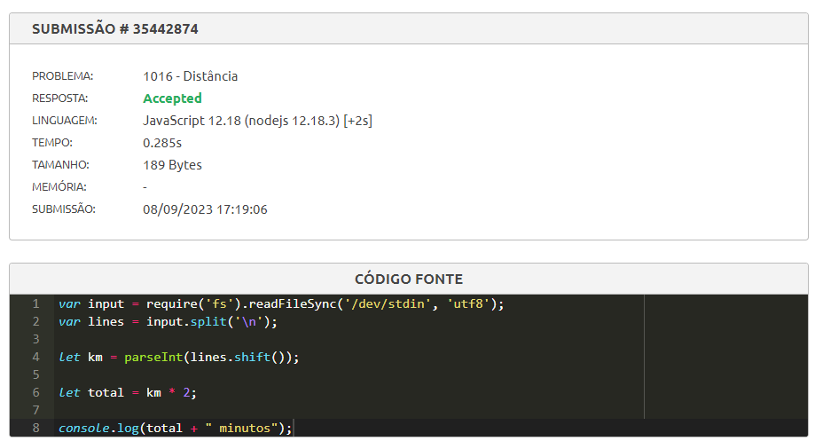
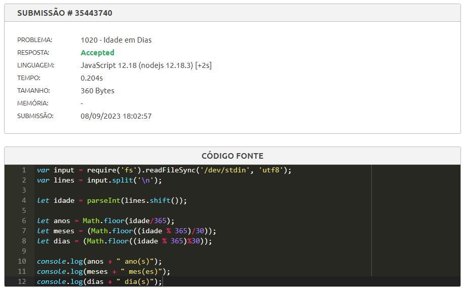
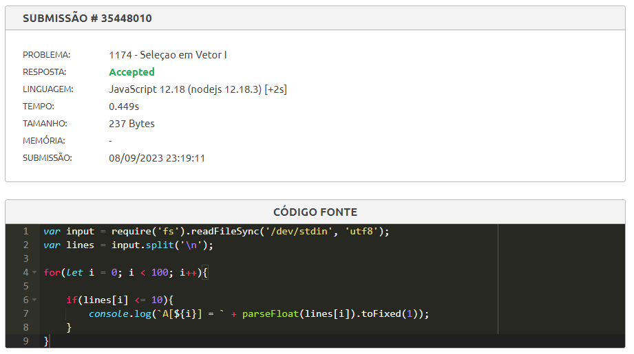
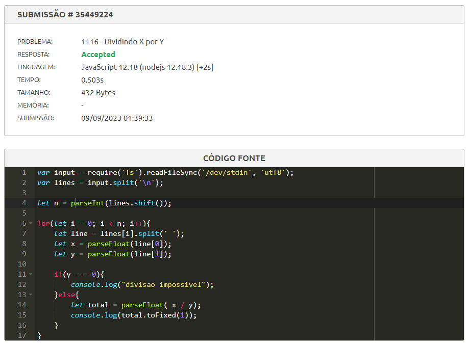
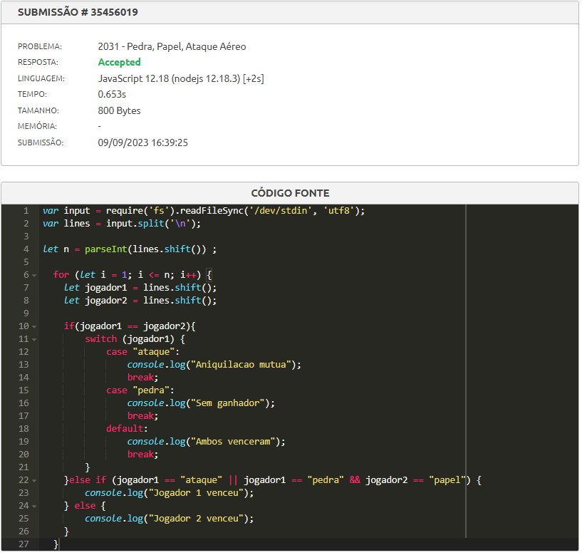
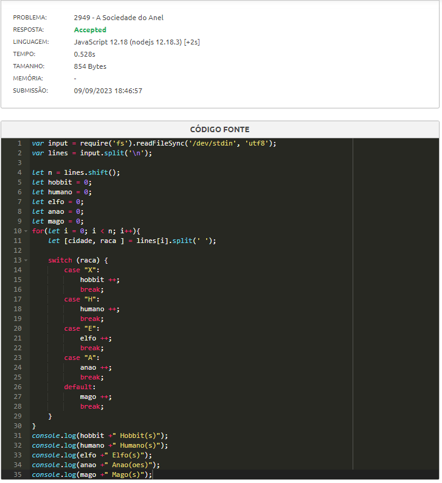
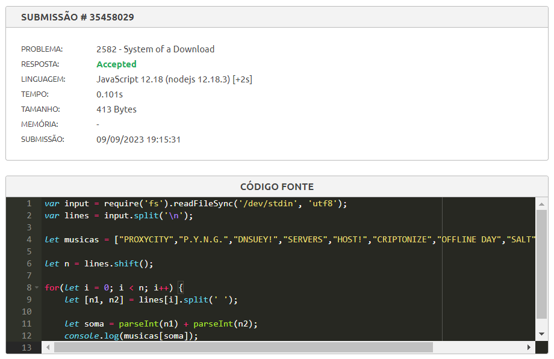

# Avaliacao-de-logica-EPDM

## Correção das questões na plataforma Beecrowd

1. Distância (1016 - https://www.beecrowd.com.br/judge/pt/problems/view/1016).

2. Idade em Dias (1020 - https://www.beecrowd.com.br/judge/pt/problems/view/1020).

3. Seleção em Vetor I (1174 - https://www.beecrowd.com.br/judge/pt/problems/view/1174).

4. Dividindo X por Y (1116 - https://www.beecrowd.com.br/judge/pt/problems/view/1116).

5. Pedra, Papel, Ataque Aéreo (2031 - https://tinyurl.com/3mx8w7fe).

6. A Sociedade do Anel (2949 - https://tinyurl.com/cn7yu9vw).

7. System of a Download (2582 - https://tinyurl.com/5n7jcccm).
